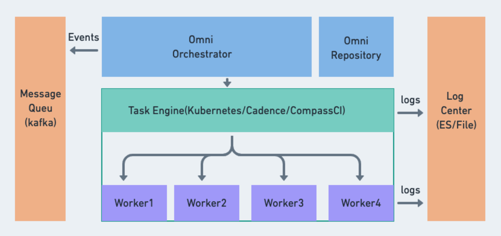

# Omni Orchestrator 
`Omni-Orchestrator`是统一构建平台(OBP)负责任务生命周期管理的组件，项目分为两部分:
1. `Omni-Orchestrator`: 框架负责跟任务的通用逻辑，比如任务创建，调度，管理，日志收集等，项目的目的在于集成现有通用任务调度框架集群管理及高并发能力，同时解耦底层的任务引擎，比如kubernetes，cadence, airflow，compass-ci等组件，在OBP整个系统中Omni-Orchestrator需要和特定的Worker一起配合才能完成某一项特定的任务执行逻辑。
2. `Omni-Imager/Omni-Packer`: 提供具体的构建能力，是真正执行底层逻辑的组件，比如Omni-Imager提供具体的构建，裁剪ISO的能力。

整个服务包含的组件如下:


# 目标
围绕任务管理，整体需要满足以下几个诉求:
1. 任务的生命周期管理(创建/删除/查询)
2. 任务日志的查询(实时/归档)
3. 任务的事件推送(Notify on Job Changed)
4. 服务支持水平扩展
5. 支持多任务架构(X86&Aarch64)
6. 支持任务引擎多实例配置
7. 基础的API权限管理(Basic Auth?)
8. 具体的Worker(定制裁剪ISO&RPM&SRPM等)

# 本地开发
默认情况下`Omni-Orchestrator`依赖cassandra和kubernetes的环境。
1. **cassandra**: cassandra的环境准备已经集成到Makefile，可以通过`make cassandra`快速拉起一个docker环境下的cassandra实例，程序会等待cassandra连接就绪，并完成实例的本地端口(9042)映射与数据表的初始化，也就是说，命令完成后，可以在本机通过`cqlsh`连接数据库。
2. **kubernetes**: 服务通过配置的kubeconfig文件与kubernetes通信，并管理kubernetes上面的任务资源，具体在配置文件中的`engine.x86ConfigFile`与`engine.aarch64ConfigFile`, 服务启动前需要修改`config/dev.app.toml`文件，确保kubernetes正确连接。

准备完成后，执行`make run`,便可以正常拉起服务，通过访问 `http://127.0.0.1:8080/v1/swagger/index.html` 查看具体的API文档。

# 服务部署
部署Yaml归档在`deploy`目录，服务所依赖的所有kubernetes资源都包含在内，基于实际的部署场景，需要优先修改ingress domain&secret，pvc storage class, database version等信息, 可以通过命令`make generate`更新yaml信息，并生成最终的yaml

# 技术细节
## 服务框架
Golang+Gin

## 数据库

数据库在`Omni-Orchestrator`里面核心的功能是任务状态存储+任务日志存储，结合实际的任务及日志存储量，有几点需要满足:
1. 数据量大，支持水平扩展，分布式。
2. 写大于读，更新少，数据能自动清理。
3. 数据结构简单。

由此，我们选择了基于Cassandra设计数据模型，核心的PrimaryKey设计及核心字段如下。
1. `Service`: 服务名，跟接入的服务类型保持一致。
2. `Task`: 任务类型，跟后端支持的任务类型保持一致。
3. `Domain`: 领域信息，跟namespace概念一致。
4. `job_date`: 任务创建的时间
5. `job_id`: 任务ID，timestamp uuid。
```shell
# Job
PRIMARY KEY  ((service, task), domain, job_date, job_id)
# Logs
PRIMARY KEY  ((service, task), domain, job_id, step_id, log_time)
) WITH CLUSTERING ORDER BY (domain ASC, job_id ASC, step_id ASC, log_time ASC);
```
## 任务引擎
基于kubernetes的任务平台构建方案是开始的优选，而且CRD+Operator的模型或者现有云原生任务框架(Tekton)等都能比较容易的满足，最终新引入一层主要是考虑到
在kubernetes在某些场景的支持上可能存在短板(比如任务并发，日志管理，除去X86及Aarch64的多架构支持等)，因此目前的策略是前期引入Kubernetes作为任务引擎，同时支持配置其他任务引擎做补足。

## 任务扩展
整个构建平台涉及多种具体任务的开发，如ISO构建，RPM构建，SRPM打包，考虑到每种任务的规格，参数，以及Worker版本都需要灵活配置，为满足快速开发和更新的需求，
任务的通用部分放在了核心的逻辑里面，具体的任务可通过插件+模板的方式快速开发，服务本身也支持SIGHUP重载模板文件，确保更新的有效及服务不中断，每个扩展的任务需要实现2个函数，
```go
type JobHandler interface {
	//reload templates
    Reload()
    //generate serialized kubernetes yaml bytes
    Serialize(namespace, name string, parameters map[string]interface{}) (map[string][]byte, string, error)
}
```

以ISO构建举例, 任务需要的资源都通过go template的模式单独配置:
```shell
➜  kubernetes_templates: tree -L 2
.
└── buildimagefromrelease
    ├── configmap.yaml
    └── job.yaml
➜  kubernetes_templates: cat buildimagefromrelease/configmap.yaml
apiVersion: v1
data:
  conf.yaml: |-
    working_dir: /data/omni-workspace
    debug: True
    user_name: root
    user_passwd: openEuler
    installer_configs: /etc/omni-imager/installer_assets/calamares-configs
    systemd_configs: /etc/omni-imager/installer_assets/systemd-configs
    init_script: /etc/omni-imager/init
    installer_script: /etc/omni-imager/runinstaller
    repo_file: /etc/omni-imager/repos/{{ index . "version" }}.repo
    use_cached_rootfs: True
    cached_rootfs_gz: /data/rootfs_cache/rootfs.tar.gz
  openEuler-customized.json: |-
    {{ index . "packages" }}
kind: ConfigMap
metadata:
  name: {{ index . "name" }}
  namespace: {{ index . "namespace" }}
```

## 日志收集
当前任务收集依赖于kubernetes API的能力，核心是`kubectl log`指令的复用，在多任务同时执行的时候，会存在性能瓶颈，后续需要将这部分功能整体迁移至worker(pod)本身。

## 水平扩展
任务的状态信息同步及日志收集均依赖后台goroutine，即使后续迁移日志收集逻辑到worker本身，`Orchestrator`本身也存在单点故障和性能瓶颈，因此我们需要考虑服务的多节点支持。

## 数据库迁移
项目使用[golang-migrate](https://github.com/golang-migrate)完成数据库的schema版本管理，部署应用会自动使用CMD完成数据库schema的升级，开发过程中数据库的变更需要使用命令创建sql文件:
```shell
migrate create -ext sql -dir database/schema/cassandra/migrations -seq <db-migrate-notice>
```